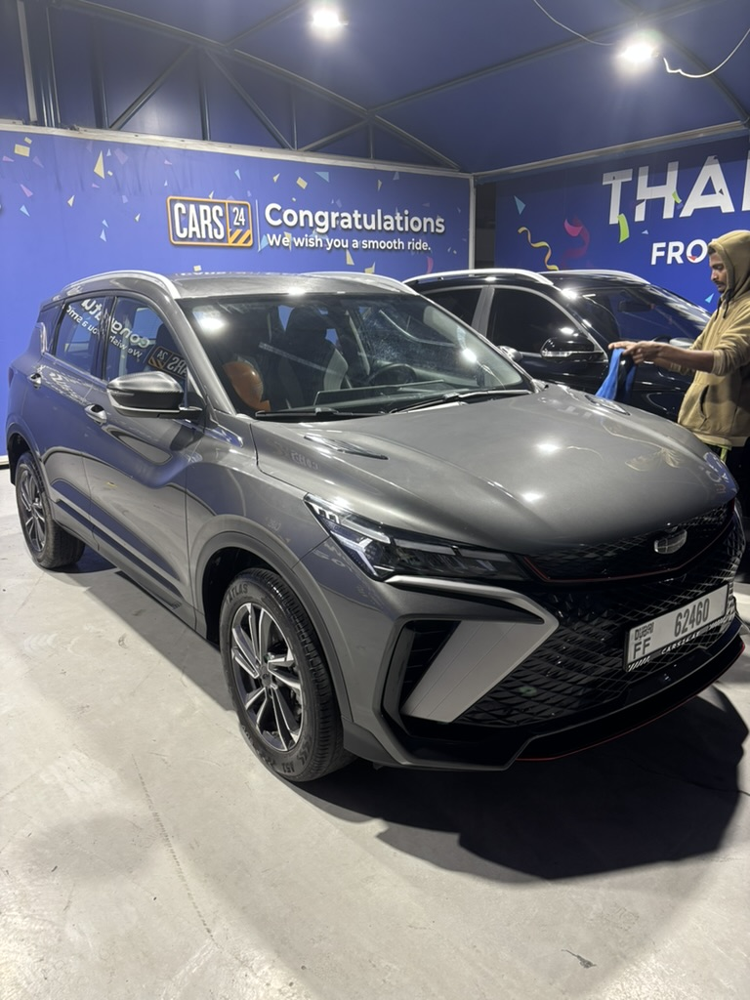
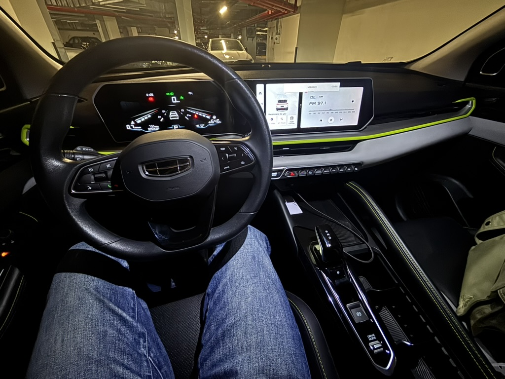
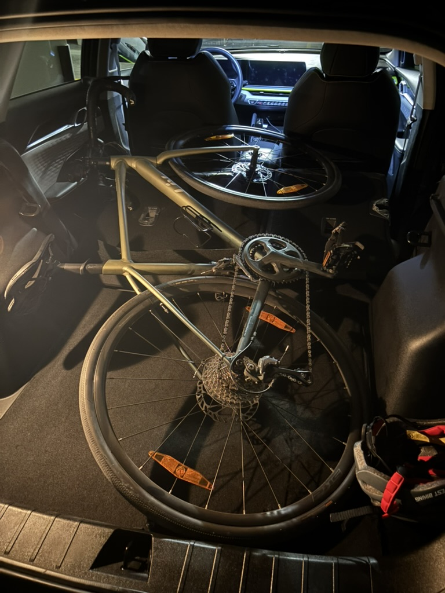
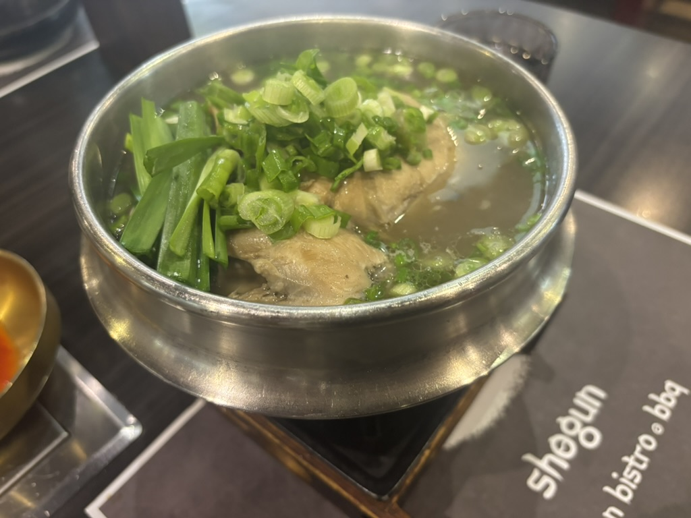

Hi.
Recently the weather is pretty cold. I know it's unbelievable but it's true.
It's not always hot even in Dubai. but of course I don't recommend vising here in summer

I bought a car from my colleague who was leaving Dubai.
It worked well for 3months but unfortunately it broke down a few days ago.
As you see it's quite old car that has been driven for 140k km.
But at least it was so helpful when I moved to a new house.
You did a good job my buddy. Good bye.

This is my new car. Even though it's not brand new, I'm so happy to have it.
Looking back, I never bought a car that I really wanted before.
As long as it was cheap and working fine, I was okay with it.
But this time I bought a car that I wanted.

It's not a big SUV, but it's pretty spacious for me.
But the most important thing is..

...the trunk size. I cycle every weekend, so I need to put my bike in the trunk.
Thank god. It fits perfectly. If it didn't fit, I would refund it as well

This is the holy place for cyclists in Dubai. The total course distance is over 100km. I usually ride 50km~70km every weekend.

<iframe src="https://www.google.com/maps/embed?pb=!1m18!1m12!1m3!1d58079.76!2d55.28!3d24.97!2m3!1f0!2f0!3f0!3m2!1i1024!2i768!4f13.1!3m3!1m2!1s0x3e5f7a72e6fac31b%3A0xb4fefcbefd74870e!2sAl%20Qudra%20Cycle%20Track!5e0!3m2!1sen!2sae!4v1706816400000" width="100%" height="300" style="border:0; border-radius:8px; margin: 20px 0;" allowfullscreen="" loading="lazy" referrerpolicy="no-referrer-when-downgrade"></iframe>

After working out. Taking protein is mandatory :)