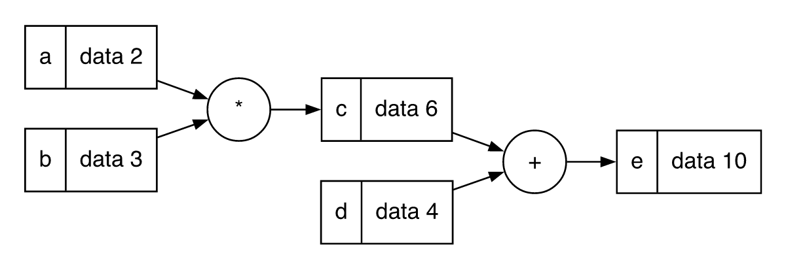
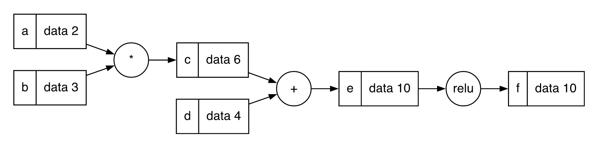
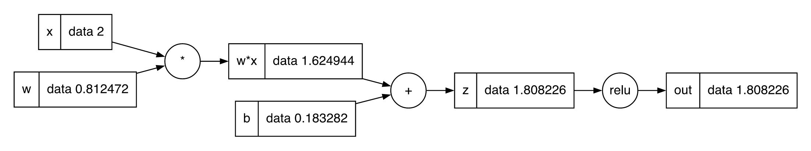

## Intro

I'm picking up AI again, starting with this repo: [karpathy/micrograd](https://github.com/karpathy/micrograd)

Back in college, I studied AI as part of a course, but I didn't put much time into it.
Now that AI is literally changing the world, I want to understand it inside and out. This is my first real step.

My C++ version is here: [sakusi4/micrograd.cpp](https://github.com/sakusi4/micrograd.cpp)

One thing I did differently.
Karpathy builds the whole thing first (Value, Neuron, Layer, MLP) and then trains the MLP.
I trained **one neuron** first. One weight, one bias, one input.
It's small enough to calculate every gradient by hand and check it against the code, number by number.
Once that works, going to an MLP is just stacking more of the same thing.

## The idea

The idea behind training is so clear and beautiful that it honestly shocked me.

1. Run the inputs through the function (forward pass)
2. Compare the result with the target
3. Measure how far off it is (loss)
4. Figure out how much each weight contributed to that error (gradient)
5. Nudge each weight a little in the right direction
6. Go back to 1

That's all it does. My instant noodles have longer instructions.

I started with this very simple expression:

$e = ab + d$



Then I added an activation function after e.
Without one, no matter how many neurons we stack, the whole thing is still just one big linear function.

$f = \text{relu}(e)$



This is the neuron I just made:

```cpp
class Value {
public:
    struct Node {
        double value;
        std::vector<std::shared_ptr<Node>> prev;

        Node(double v, std::vector<std::shared_ptr<Node>> children = {})
            : value(v), prev(std::move(children)) {}
    };

    std::shared_ptr<Node> node;

    Value(double _value, std::vector<std::shared_ptr<Node>> children = {})
        : node(std::make_shared<Node>(_value, std::move(children))) {}

    Value operator+(const Value& other) const {
        return Value(node->value + other.node->value, {node, other.node});
    }

    Value operator*(const Value& other) const {
        return Value(node->value * other.node->value, {node, other.node});
    }

    Value relu() const {
        return Value(std::max(0.0, node->value), {node});
    }
};

class Neuron {
public:
    std::vector<Value> w;
    Value b{0};

    Neuron(int nin) {
        std::mt19937 gen(std::random_device{}());
        std::uniform_real_distribution<double> dist(-1.0, 1.0);

        for (int i = 0; i < nin; i++) {
            w.push_back(Value(dist(gen)));
        }

        b.node->value = dist(gen);
    }

    Value forward(const std::vector<Value>& inputs) {
        Value sum = b; // start from b instead of 0 to avoid an extra node
        for (size_t i = 0; i < inputs.size(); i++) {
            sum = sum + (w[i] * inputs[i]);
        }

        return sum.relu();
    }
};
```

Value wraps a number and remembers which values it was made from. That's where the graphs above come from.
Karpathy's Value overloads a lot more operators, but I only implemented `+`, `*` and `relu`,
because that's enough to run a basic case and understand how it works.

Neuron holds its weights as a vector of Values and initializes them with random numbers between -1 and 1.

```cpp
int main() {
    std::vector<Value> xs = {Value(2.0)};

    Neuron neuron(1);
    Value output = neuron.forward(xs);

    std::println("output => {}", output.node->value); // std::println needs C++23

    return 0;
}
```

```text
output => 1.808225754493986
```

The forward method multiplies each input by its weight, adds them up with the bias, and passes the result through relu.



OK, now what if I want to train it so the output becomes 1? What should I do?

All I can change are the weights and the bias, since the inputs are fixed.
But before changing anything, I need to know how much each weight affects the output. That's the gradient.

I think of it as turning a volume knob. Nudge it just a little and see how much the volume changes per step. That ratio is exactly what a gradient is.

It's also easy to calculate. Especially with only one neuron.

## Calculating the gradient

First, I need a single number that tells me how wrong the output is. This is called the **loss**.
The simplest one is the squared error:

$$
L = (\text{out} - \text{target})^2
$$

Squaring keeps it positive, and it grows the further we are from the target.

Here are the numbers from the graph above:

|        | value    |
| ------ | -------- |
| $x$    | 2        |
| $w$    | 0.812472 |
| $b$    | 0.183282 |
| target | 1        |

Forward pass:

$$
\begin{aligned}
z &= w \cdot x + b = 0.812472 \times 2 + 0.183282 = 1.808226 \\
\text{out} &= \text{relu}(z) = 1.808226 \\
L &= (1.808226 - 1)^2 = 0.653229
\end{aligned}
$$

Now I want $\frac{\partial L}{\partial w}$ and $\frac{\partial L}{\partial b}$.
In plain words: if I nudge $w$ (or $b$) a tiny bit, how much does $L$ change?

### The chain rule

$L$ doesn't depend on $w$ directly. It goes through a chain: $w \to z \to \text{out} \to L$.
The chain rule says we can find how much each link changes the next one, and just multiply them together:

$$
\frac{\partial L}{\partial w} = \frac{\partial L}{\partial \text{out}} \cdot \frac{\partial \text{out}}{\partial z} \cdot \frac{\partial z}{\partial w}
$$

(Karpathy's video explains this much better than I can. Here I'll just do the math for my one neuron.)

Each link is easy on its own:

- Loss: $\frac{\partial L}{\partial \text{out}} = 2(\text{out} - \text{target}) = 2 \times 0.808226 = 1.616452$
- relu: slope is 1 if $z > 0$, otherwise 0. $z = 1.808226$, so it's 1.
- $z = w \cdot x + b$: $\frac{\partial z}{\partial w} = x = 2$, $\frac{\partial z}{\partial b} = 1$

Multiply them together:

$$
\begin{aligned}
\frac{\partial L}{\partial w} &= 1.616452 \times 1 \times 2 = 3.232904 \\
\frac{\partial L}{\partial b} &= 1.616452 \times 1 \times 1 = 1.616452
\end{aligned}
$$

### Checking with the volume knob

Then I actually turned the knob. I nudged $w$ by 0.001 and ran the forward pass again:

$$
\begin{aligned}
z' &= 0.813472 \times 2 + 0.183282 = 1.810226 \\
L' &= (1.810226 - 1)^2 = 0.656466 \\
\frac{L' - L}{0.001} &= \frac{0.656466 - 0.653229}{0.001} \approx 3.237
\end{aligned}
$$

Almost exactly the 3.232904 I got from the chain rule.
The tiny difference is only because 0.001 isn't infinitely small.

### What the gradient tells us

Both gradients are positive. That means increasing $w$ or $b$ makes the loss bigger.
So to bring the output down to 1, I should move both of them a little in the opposite direction.
And since $w$'s gradient is twice as big, nudging $w$ moves the loss twice as much as nudging $b$.

### The pattern

Then I noticed something. Each node only needed its own small rule:

- `+` passes the gradient to both inputs unchanged
- `*` sends each input the gradient times the *other* input
- `relu` passes the gradient through if its output was positive, otherwise sends 0

The gradient starts at the end and flows backwards through the graph, node by node.
That's **backpropagation**.

Next step: teach `Value` to do this by itself.

## Backpropagation in code

Each node gets two new things:

- `grad`: how much the final output changes when this node changes
- `_backward`: the node's own small rule from the list above

```cpp
struct Node {
    double value;
    double grad{0.0};
    std::vector<std::shared_ptr<Node>> prev;
    std::function<void()> _backward;
};
```

Every operator creates a new node and attaches its rule to it:

```cpp
Value operator+(const Value& other) const {
    Value ret = Value(this->node->value + other.node->value, {this->node, other.node});

    ret.node->_backward = [ret_node = ret.node.get(), this_node = this->node, other_node = other.node]() {
        this_node->grad += ret_node->grad;
        other_node->grad += ret_node->grad;
    };

    return ret;
}

Value operator*(const Value& other) const {
    Value ret = Value(this->node->value * other.node->value, {this->node, other.node});

    ret.node->_backward = [ret_node = ret.node.get(), this_node = this->node, other_node = other.node]() {
        this_node->grad += other_node->value * ret_node->grad;
        other_node->grad += this_node->value * ret_node->grad;
    };

    return ret;
}

Value relu() const {
    Value ret = Value(std::max(0.0, this->node->value), {this->node});

    ret.node->_backward = [ret_node = ret.node.get(), this_node = this->node]() {
        if (this_node->value > 0) {
            this_node->grad += ret_node->grad;
        }
    };

    return ret;
}
```

(That `.get()` on `ret_node` is a whole story. I'll come back to it in the C++ part.)

### `operator-`

To calculate the loss, I also need `output - target`, so I added `operator-`.

For $\text{out} = a - b$:

$$
\frac{\partial \text{out}}{\partial a} = 1, \qquad \frac{\partial \text{out}}{\partial b} = -1
$$

So it's the same as `+`, except the gradient going to the right side is flipped:

```cpp
Value operator-(const Value& other) const {
    Value ret = Value(this->node->value - other.node->value, {this->node, other.node});

    ret.node->_backward = [ret_node = ret.node.get(), this_node = this->node, other_node = other.node]() {
        this_node->grad += ret_node->grad;
        other_node->grad -= ret_node->grad;
    };

    return ret;
}
```

### Why `+=` and not `=`

```cpp
Value diff = output - target;
Value error = diff * diff;
```

`diff` is used **twice**. It gets one gradient from each side of `*`, and both are real effects on the loss, so they have to be added up.
With `=`, the second one would overwrite the first:

$$
\text{diff.grad} = \text{diff} \times 1 + \text{diff} \times 1 = 2(\text{out} - \text{target})
$$

That's exactly $\frac{\partial L}{\partial \text{out}}$ from my hand calculation.

This is also why I have to reset every `grad` to 0 before each backward pass. Otherwise, they keep piling up from the previous round.

### `backward()` and the topological sort

The last piece is calling every node's `_backward`. But the **order** matters.

A node's `_backward` passes its own `grad` to its inputs.
So before it runs, its `grad` has to be complete. Every node that uses it must have already sent its share.

#### When the order goes wrong

Take this tiny graph:

```text
c = a + b
d = c + a
```

`a` reaches `d` in two ways: directly, and through `c`.
So $\frac{\partial d}{\partial a}$ should be 2.

Start with `d.grad = 1` and run the rules in the right order:

1. `d` runs: `c.grad += 1`, `a.grad += 1`
2. `c` runs: `a.grad += 1`, `b.grad += 1`

`a.grad = 2`, `b.grad = 1`. Correct.

Now run `c` first:

1. `c` runs: `c.grad` is still 0, so it passes 0 to `a` and `b`
2. `d` runs: `c.grad += 1` (too late, `c` already ran), `a.grad += 1`

`a.grad = 1`, `b.grad = 0`. Wrong.

#### The rule

> Run a node's `_backward` only after every node that uses it has run.

A **topological sort** gives us exactly this.
It lines up the nodes so that every node comes **after** all of its inputs.
Reverse that list, and every node comes **before** its inputs.

```cpp
void backward() {
    std::vector<Node*> topo;
    std::unordered_set<Node*> visited;

    auto build_topo = [&](auto& self, Node* n) -> void {
        if (!n || visited.contains(n))
            return;

        visited.insert(n);
        for (const auto& child : n->prev) {
            self(self, child.get());
        }

        topo.push_back(n);
    };

    build_topo(build_topo, this->node.get());

    this->node->grad = 1.0;
    for (auto it = topo.rbegin(); it != topo.rend(); it++) {
        if ((*it)->_backward) {
            (*it)->_backward();
        }
    }
}
```

It's a depth-first search that pushes a node only **after** all of its inputs (`prev`) have been pushed.
`visited` makes sure each node is added only once. Otherwise a node with two users would run its `_backward` twice.
For the tiny graph above, we get `topo = [a, b, c, d]`. Reversed: `d, c, b, a`, the correct order.

The output's own grad is set to 1 first, because changing the loss by 1 changes the loss by 1. Deep stuff.

(The `auto& self` thing is because a C++ lambda can't call itself by name. So I pass it to itself. Feels illegal, but it compiles.)

#### Back to my neuron

Here's what it looks like for my neuron and its loss, starting from `error`:

(I left relu out here. I'll explain why in the training section.)

```text
topo     = [b, w, x, w*x, z, target, diff, error]
reversed = [error, diff, target, z, w*x, x, w, b]
```

`diff` is reached twice (`diff * diff`), but `visited` keeps it in the list once.

Walking the reversed list:

| step | node    | what its `_backward` does                          | result                                  |
| ---- | ------- | -------------------------------------------------- | --------------------------------------- |
| 1    | `error` | `*`: sends `diff` the other side × 1, twice        | `diff.grad` = 2 × 0.808226 = 1.616452   |
| 2    | `diff`  | `-`: passes to `z`, flipped to `target`            | `z.grad` = 1.616452, `target.grad` = −1.616452 |
| 3    | `target`| leaf, nothing to do                                |                                         |
| 4    | `z`     | `+`: passes to both inputs                         | `b.grad` = `(w*x).grad` = 1.616452      |
| 5    | `w*x`   | `*`: sends each input the other side × 1.616452    | `w.grad` = 3.232904, `x.grad` = 1.313322 |
| 6–8  | `x`, `w`, `b` | leaves, nothing to do                        |                                         |

The same numbers as my hand calculation.

## Training one neuron

Now I have everything I need:

1. forward pass
2. loss
3. reset the grads, then `backward()`
4. update

```cpp
int main() {
    std::vector<Value> xs = {Value(2.0)};
    Value target(1.0);

    Neuron neuron(1, false); // nonlin = false, no relu on the output

    // same starting point as the hand calculation
    neuron.w[0].node->value = 0.812472;
    neuron.b.node->value = 0.183282;

    for (int epoch = 0; epoch < 50; epoch++) {
        Value output = neuron.forward(xs);

        Value diff = output - target;
        Value error = diff * diff;

        for (auto* p : neuron.parameters()) {
            p->node->grad = 0.0;
        }

        error.backward();

        for (auto* p : neuron.parameters()) {
            std::println("Grad => {}", p->node->grad);
        }

        for (auto* p : neuron.parameters()) {
            p->node->value -= 0.02 * p->node->grad;
        }

        std::println("Epoch {}: loss = {:.4f}", epoch, error.node->value);
    }

    Value y_pred = neuron.forward(xs);
    std::println("y_pred => {}, target => {}", y_pred.node->value, target.node->value);

    return 0;
}
```

The update is `value -= 0.02 * grad`.
The minus is the "opposite direction" part: a positive gradient means "going up makes the loss worse", so we go down.
0.02 is the **learning rate**, how big each step is. Too big, and we jump past the target. Too small, and it takes forever.

Only the parameters get their grads reset. `x` and `target` collect grads too, but nobody ever reads them, so they can pile up all they want.

`Neuron` now also has a `parameters()` method that returns its weights and bias, and a `nonlin` flag.
For a single output neuron I turned relu off (`nonlin = false`), the same as karpathy does for the last layer.
With relu, the output could never go below 0. And once it got stuck at 0, the gradient would stop flowing.
(z is positive here, so relu's slope was 1 anyway. The hand calculation doesn't change.)

```text
Grad => 3.2329039999999996
Grad => 1.6164519999999998
Epoch 0: loss = 0.6532
Grad => 2.5863232
Grad => 1.2931616
Epoch 1: loss = 0.4181
Grad => 2.06905856
Grad => 1.03452928
Epoch 2: loss = 0.2676
Epoch 3: loss = 0.1712
Epoch 4: loss = 0.1096
Epoch 5: loss = 0.0701
...
Epoch 10: loss = 0.0075
...
Epoch 20: loss = 0.0001
...
Epoch 49: loss = 0.0000
y_pred => 1.0000115353869368, target => 1
```

Epoch 0. The gradients are **3.232904** and **1.616452**, exactly what I calculated by hand.
And the loss goes down every epoch until the output is basically 1.

This is the moment I was waiting for. Pen and paper on one side, the program on the other, same numbers.
With a whole MLP, I'd just have to trust it.

## Extending to an MLP

Honestly, there isn't much to say here. Once one neuron trains, the rest is just stacking:

- `Layer`: a vector of neurons. Every neuron gets the same inputs, and the layer returns all of their outputs.
- `MLP`: a vector of layers. Each layer's outputs become the next layer's inputs.

```cpp
// Layer
std::vector<Value> forward(const std::vector<Value>& inputs) {
    std::vector<Value> out;
    for (auto& itr : n) {
        out.push_back(itr.forward(inputs));
    }
    return out;
}

// MLP
std::vector<Value> forward(std::vector<Value> inputs) {
    for (size_t i = 0; i < l.size(); i++) {
        inputs = l[i].forward(inputs);
    }
    return inputs;
}
```

That's it. Vectors of vectors. I'm not going to pretend this part was hard.

`MLP model(3, {4, 4, 1})` means 3 inputs, two hidden layers with 4 neurons each, and 1 output.
Hidden layers use relu. The last layer doesn't, so the output can be negative.

`Value` doesn't change at all. The graph just gets bigger, and `backward()` handles it the same way.
This is where the topological sort really matters: every hidden neuron's output goes into all 4 neurons of the next layer, so almost every node has several users.

The training loop is almost the same as before. The only difference is that I now have 4 examples, so I add up their squared errors into one `total_loss` and call `backward()` on that.
I also changed the bias to start at 0. The full code is in the [repo](https://github.com/sakusi4/micrograd.cpp).

```text
Epoch 0: loss = 7.5134
Epoch 1: loss = 7.2841
Epoch 2: loss = 1.8611
Epoch 3: loss = 0.8682
Epoch 4: loss = 0.5782
...
Epoch 9: loss = 0.1704
...
Epoch 19: loss = 0.0732
...
Epoch 29: loss = 0.0344
...
Epoch 39: loss = 0.0177
...
Epoch 49: loss = 0.0092
y_pred => 1.0343216178873411, ys => 1
y_pred => -1.0019122336702346, ys => -1
y_pred => -1.001121397417316, ys => -1
y_pred => 0.9137720345453981, ys => 1
```

All four predictions end up close to their targets.

The weights are random, so every run is different. Some runs don't get there in 50 epochs.
That usually happens when some relu neurons start out outputting 0 for every input. Then their gradient is always 0, and they never learn.
Running it again or training for more epochs usually fixes it.

## The C++ part

Up to here, it's basically karpathy's micrograd with more semicolons.
But Python was quietly doing a few things for me, and C++ made me do them myself.

### Why `shared_ptr` at all

The reason is this line in `Neuron::forward`:

```cpp
sum = sum + (w[i] * inputs[i]);
```

`w[i] * inputs[i]` is a temporary. In C++, it dies at the semicolon.
But the graph still needs it later, during `backward()`.

In Python, this just works. Everything is a reference, and an object lives as long as someone points to it.
In C++, I had to build that myself.

So `Value` is just a handle, and the real data lives in a `Node` on the heap:

```cpp
class Value {
public:
    struct Node { /* value, grad, prev, _backward */ };
    std::shared_ptr<Node> node;
};
```

Each node holds `shared_ptr`s to its inputs in `prev`. So as long as the final `error` is alive, the whole graph behind it stays alive.
And when `error` goes out of scope, everything gets freed in a chain.

Copying a `Value` copies the handle, not the node. That's why `Value sum = b;` doesn't create a new node,
and why `p->node->value -= ...` in the training loop updates the real weight that every graph points to.

### The memory leak

That chain of freeing was supposed to happen. My first version captured `ret.node` itself in the lambda:

```cpp
ret.node->_backward = [ret_node = ret.node, ...]() { ... };
```

This looks fine, but it never frees anything.
The node owns `_backward`, and `_backward` owns a `shared_ptr` to the same node.
They keep each other alive forever, so the reference count never reaches 0.

```text
Node ──owns──> _backward (lambda)
  ^                 │
  └─────owns────────┘
```

Python's garbage collector finds cycles like this and cleans them up, which is why karpathy's version doesn't have this problem.
C++'s `shared_ptr` only counts. It has no idea it's in a circle.

#### Counting the ghosts

A leak like this doesn't crash. Everything works, the loss goes down, life is good. Time to count the nodes:

```cpp
struct Node {
    static inline int alive = 0;

    Node(double v, std::vector<std::shared_ptr<Node>> children = {})
        : value(v), prev(std::move(children)) { alive++; }
    ~Node() { alive--; }
    // ...
};
```

After the single neuron training, with everything out of scope, `Node::alive` should be 0. It was **206**.

And 206 adds up exactly:

- each epoch creates 4 new nodes (`w*x`, `z`, `diff`, `error`), and all of them leak: 4 × 50 = 200
- the last `forward` for `y_pred`: 2 more
- the leaked nodes hold on to the leaves (`w`, `b`, `x`, `target`): 4 more

200 + 2 + 4 = 206.

206 nodes, living in my RAM rent-free.
For the MLP it's worse. 305 new nodes per epoch, so **15,591** leaked after 50 epochs and **305,341** after 1000.

#### Two ways to fix it

The lambda only needs to *look at* its own node. It doesn't need to *own* it. So I break the cycle on that side.

**1. `weak_ptr`**

```cpp
ret.node->_backward = [ret_node = std::weak_ptr<Node>(ret.node), ...]() {
    auto out = ret_node.lock();
    this_node->grad += out->grad;
    // ...
};
```

This works. `alive` goes back to 0.
But every `_backward` call now does a `lock()`, which bumps the reference count up and down,
and in theory I should check if `out` is null, which can never happen.

**2. Raw pointer**

```cpp
ret.node->_backward = [ret_node = ret.node.get(), ...]() { ... };
```

This is safe because `_backward` belongs to that node. If the lambda is running, the node is still alive. There's no way to call one without the other.
`alive` goes back to 0 here too.

I went with the raw pointer. Both work,
but the raw pointer says what's actually true: the node owns the lambda, not the other way around.
A raw pointer in modern C++ looks scary, but here it just means "I'm looking, not owning."

Only `ret_node` changes. `this_node` and `other_node` stay `shared_ptr`. They point to the inputs, not back to the node itself, so there's no cycle there.

## Wrap-up

That's the whole idea of training a neural network:
calculate, measure how wrong it is, find out who's responsible, nudge them, repeat.

Start with one neuron. Check it by hand. Once the numbers match, the MLP is just more of the same.
Whether it's one neuron or a whole MLP, it's the same loop on the same `Value`.

Note to future me: in C++, count your nodes.
