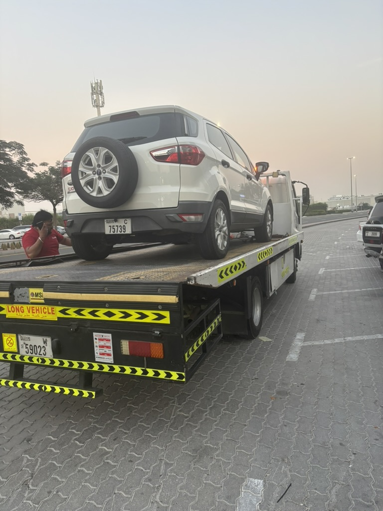
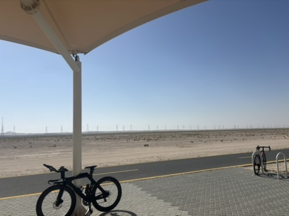

Hi.

It's been pretty cold lately. I know that sounds unbelievable, but it's true.
Dubai isn't hot all year round. That said, I still wouldn't recommend visiting in summer.

I bought this car from a colleague who was leaving Dubai.
It ran fine for three months, and then, a few days ago, it broke down.
As you can see, it's an old car with 140,000 km on it.
Still, it carried everything when I moved to a new place.
You did a good job, buddy. Goodbye.

This is my new car. It's not brand new, but I'm really happy with it.
Looking back, I'd never bought a car I actually wanted before.
As long as it was cheap and ran okay, that was enough for me.
This time, I bought the one I wanted.

It's not a big SUV, but it has plenty of room for me.
The most important thing, though...

...is the trunk. I cycle every weekend, so the bike has to fit in the back.
Thank God, it fits perfectly. If it hadn't, I would have returned the car.

This is the holy place for cyclists in Dubai. The full loop is over 100 km.
I usually ride 50 to 70 km every weekend.

<iframe src="https://www.google.com/maps/embed?pb=!1m18!1m12!1m3!1d58079.76!2d55.28!3d24.97!2m3!1f0!2f0!3f0!3m2!1i1024!2i768!4f13.1!3m3!1m2!1s0x3e5f7a72e6fac31b%3A0xb4fefcbefd74870e!2sAl%20Qudra%20Cycle%20Track!5e0!3m2!1sen!2sae!4v1706816400000" width="100%" height="300" style="border:0; border-radius:8px; margin: 20px 0;" allowfullscreen="" loading="lazy" referrerpolicy="no-referrer-when-downgrade"></iframe>

Post-ride protein. Non-negotiable :)
